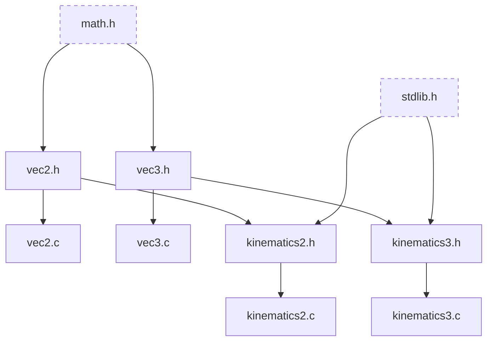

# CKinemetics

___Index: [MyCLib](../README.md)___

Library for moving kinematic object

## Dependencies

```mermaid
flowchart TD
_vec2.c_[vec2.c]
_vec3.c_[vec3.c]
_kinematics2.h_[kinematics2.h]
_kinematics3.c_[kinematics3.c]
_stdlib.h_[stdlib.h]
_math.h_[math.h]
_vec3.h_[vec3.h]
_kinematics3.h_[kinematics3.h]
_kinematics2.c_[kinematics2.c]
_vec2.h_[vec2.h]
_math.h_ ---> _vec2.h_
_math.h_ ---> _vec3.h_
_stdlib.h_ ---> _kinematics3.h_
_vec3.h_ --> _kinematics3.h_
_vec2.h_ --> _vec2.c_
_stdlib.h_ ---> _kinematics2.h_
_kinematics3.h_ --> _kinematics3.c_
_vec3.h_ --> _vec3.c_
_kinematics2.h_ --> _kinematics2.c_
_vec2.h_ --> _kinematics2.h_
style _math.h_ stroke-dasharray: 5 5
style _stdlib.h_ stroke-dasharray: 5 5
```
