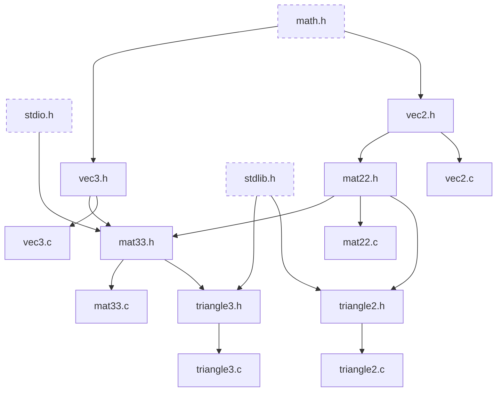

# CTriangle
___Index: [MyCLib](../README.md)___

Triangles and some operations for them
- init
- normal (3D)
- move
- transform

## Dependencies

```mermaid
flowchart TD
_vec3.c_[vec3.c]
_triangle3.c_[triangle3.c]
_vec2.c_[vec2.c]
_triangle2.h_[triangle2.h]
_triangle2.c_[triangle2.c]
_mat33.h_[mat33.h]
_mat22.c_[mat22.c]
_stdio.h_[stdio.h]
_math.h_[math.h]
_mat22.h_[mat22.h]
_stdlib.h_[stdlib.h]
_mat33.c_[mat33.c]
_vec3.h_[vec3.h]
_vec2.h_[vec2.h]
_triangle3.h_[triangle3.h]
_vec3.h_ --> _mat33.h_
_vec2.h_ --> _mat22.h_
_mat22.h_ --> _mat33.h_
_vec2.h_ --> _vec2.c_
_math.h_ ---> _vec3.h_
_math.h_ ---> _vec2.h_
_mat33.h_ --> _mat33.c_
_mat22.h_ --> _mat22.c_
_mat33.h_ --> _triangle3.h_
_mat22.h_ --> _triangle2.h_
_vec3.h_ --> _vec3.c_
_triangle2.h_ --> _triangle2.c_
_stdlib.h_ ---> _triangle3.h_
_triangle3.h_ --> _triangle3.c_
_stdio.h_ ---> _mat33.h_
_stdlib.h_ ---> _triangle2.h_
style _stdlib.h_ stroke-dasharray: 5 5
style _math.h_ stroke-dasharray: 5 5
style _stdio.h_ stroke-dasharray: 5 5

```
