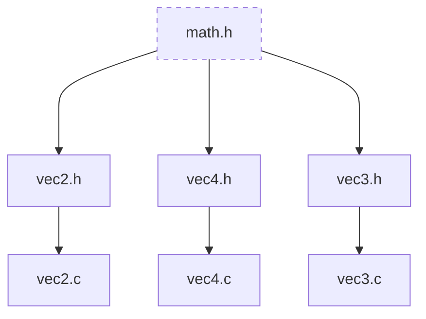

# CVector
___Index: [MyCLib](../README.md)___

2D, 3D and 4D vector structures and functions

## Dependencies

```mermaid
flowchart TD
_vec3.h_[vec3.h]
_vec2.c_[vec2.c]
_math.h_[math.h]
_vec2.h_[vec2.h]
_vec4.c_[vec4.c]
_vec3.c_[vec3.c]
_vec4.h_[vec4.h]
_vec4.h_ --> _vec4.c_
_math.h_ ---> _vec2.h_
_math.h_ ---> _vec4.h_
_vec2.h_ --> _vec2.c_
_vec3.h_ --> _vec3.c_
_math.h_ ---> _vec3.h_
style _math.h_ stroke-dasharray: 5 5
```
